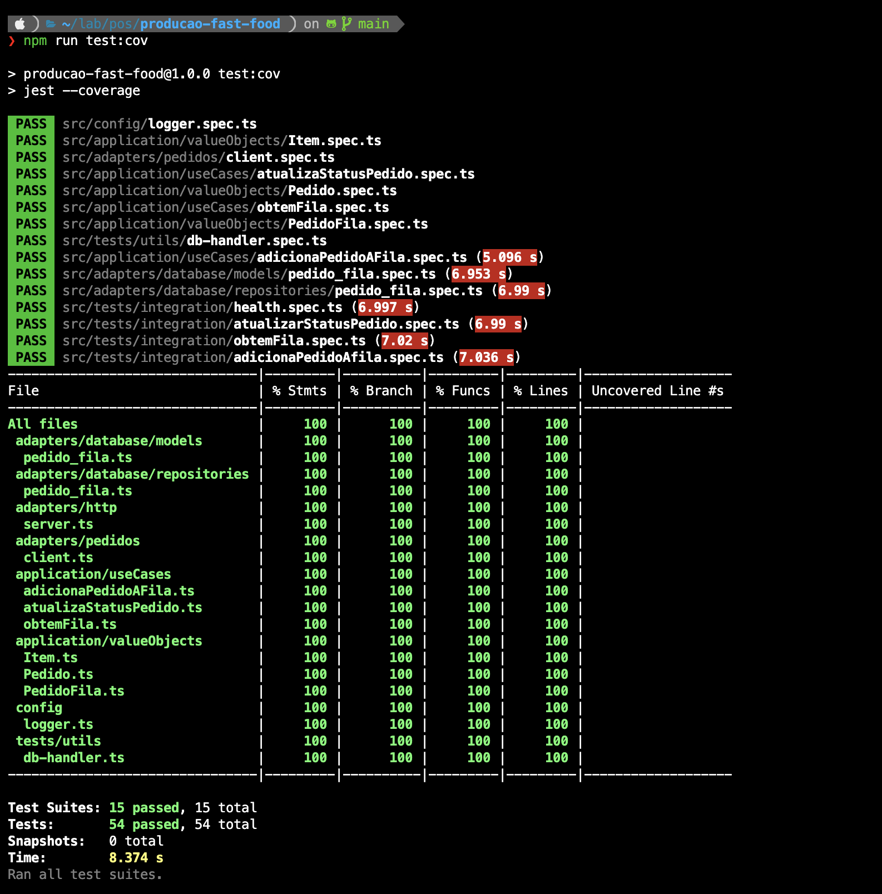

# Documentação do TechChallange: Sistema de Gerenciamento de Pedidos para Lanchonete
## Microsserviço de Produção
  

## Introdução

  

Bem-vindo à documentação do projeto para o sistema de gerenciamento de pedidos de uma lanchonete. Este guia fornece instruções detalhadas sobre como configurar, executar e interagir com a API backend.

  

## Pré-requisitos

  

Antes de iniciar, certifique-se de ter as seguintes ferramentas instaladas em sua máquina:

  

- Node.js

- npm (Node Package Manager)

- Docker

  

## Configuração do Projeto

  

1.  **Clone o Repositório:**
	```bash 
	git clone git@github.com:techChallenge-SOAT/producao-fast-food.git 
	cd producao-fast-food
	```


2. **Instale as Dependências:**

	```bash
	npm install
	```

## Docker

-  **Subir projeto**

	```bash
	docker-compose -d up
	```
- **Desligar Projeto**
	```bash 
	docker-compose down
	```


# Evidências de teste

- Testes Executados
